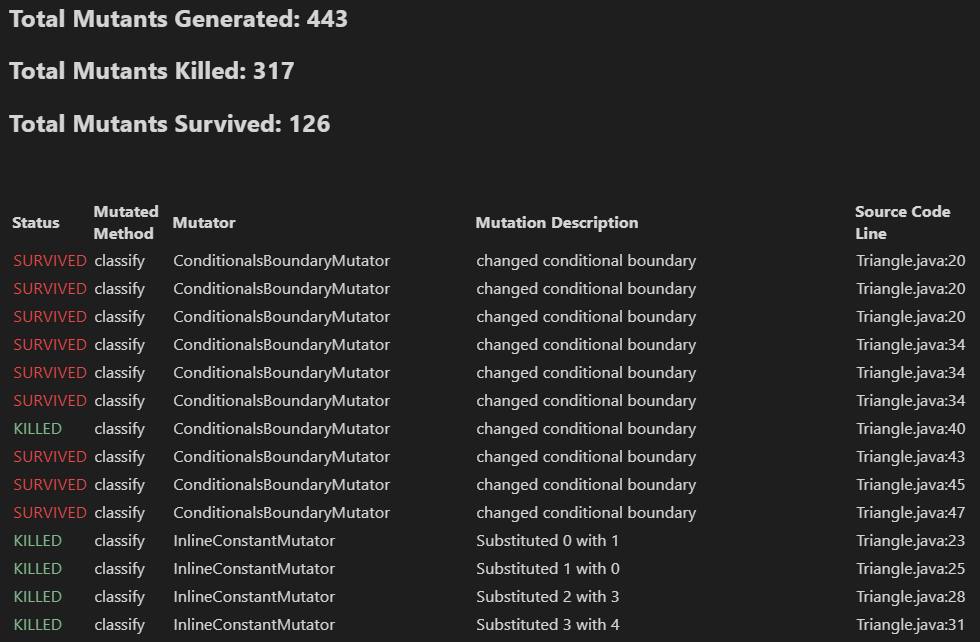
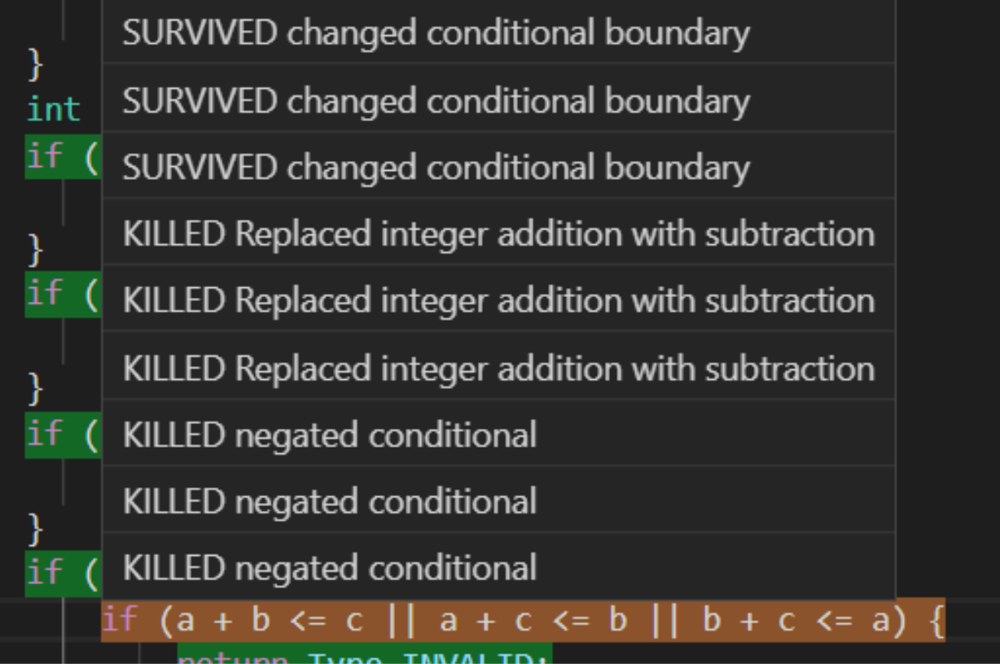

# Mutation Visualization : Evaluation

We evaluated how our plugin compares to existing mutation tools under the following characteristics:

1. Ease of setup - an important goal for product adoption is simplification of the end user setup. We want the user to be able to start visualizing mutations as quickly as possible!

2. User interface - the bulk of the value added by a visualization plugin is giving the user an intuitive, organized experience

3. Feature set - mutation testing and visualization should provide a robust feature set to help the user run mutations, and identify and evaluate mutants

4. Flexibility - the ability for our plugin to adapt the user's build setup and mutation framework choices make it more widely applicable

5. Extensibility - the ability for other developers to contribute to our project and extend it by adding new mutation frameworks or features is important to continuing improvements in the future

Existing tools we compared against are the PIT mutation testing plugin for Eclipse (NOTE:  https://marketplace.eclipse.org/content/pitclipse
) for Java, and the Stryker Mutator (NOTE:  https://github.com/stryker-mutator). We did not evaluate against the command-line, text-based mutation analysis of other frameworks, because our plugin builds on top of an existing framework to provide a more user-friendly experience.

## Ease of setup

Our mutation-viz plugin has a standalone installer which requires the user to set up an underlying test framework, which depends on your build framework:

1. For ant, a "mutate" target for the PIT or Major framework must be added to the build.xml, with the appropriate class target parameters.

2. For maven, the user must add the PIT or Major framework to the maven pom.xml build plugins.

This setup is equivalent to the setup required just to setup the PIT mutation framework through Pitclipse. Our plugin builds all the visualization on top of that basic setup.

Stryker provides a similarly simple setup, because it can be installed through npm and configured through a simple "stryker init" command which guides the user through a basic config setup which is stored locally.

## User interface

Our mutation-viz plugin provides a simple, sortable mutation summary view

And editor highlighting to analyze which lines have surviving mutants vs. lines whose mutants are killed. We also provide hoverable information about the mutations for each line.

We augmented the right-click menu for java files as well, adding commands to run mutation analysis and visualize the mutations, as well as toggle the highlighting on and off in the lower status bar.

Pitclipse doesn’t provide such an interactive UI, but does allow the user to output static html pages that summarize the results:

Stryker outputs a text-based version of the mutation results as well as a nicer looking version of the html summary page that pitest provides:

The main advantage mutation-viz provides over this approach is that our highlighting and tooltips are all built into the VS Code IDE. So, the user can edit their code, add tests, and see the results immediately in their IDE.

## Feature set

Our mutation feature set includes

* In-IDE summary of the mutation analysis results

* In-IDE text editor highlighting and hover tooltips to identify mutation results per line, which is toggleable and refreshes with every new report

* In-IDE right-click menu options to run mutation and visualize the results

* VS Code commands to run mutation analysis on the project or a specific class

As discussed in the UI section, the existing plugins provide similar features in static html/js pages for the user to browse. The built-in commands must be configured based on the user’s build and Stryker requires configuration based on the testing framework being used.

## Flexibility

Our mutation-viz plugin currently supports running on top of the PITest and Major mutation frameworks. PITest is the only framework to work with JUnit or TestNG as well as mocking frameworks JMock, EasyMock, Mockito, PowerMock and JMockit. We also detect the project’s build tool and adapts our mutate command appropriately.

We currently support both ant and maven builds.

Our visualization techniques are not framework-dependent or language-dependent, so any framework can be adapted for a language used in VS Code as long as the relevant Parser interface is implemented.

The Stryker plugins apply to a handful of languages that our plugin could be extended to cover, they are Typescript/Javascript, Scala, and C#.

## Extensibility

We provide a common mutation model that allows for our mutation visualization to be extended to any other mutation framework you may want to work with using VS Code. The steps needed are to:

1. Add your mutation command to be invoked when a user runs the mutate command 

2. Extend the mutation parser to translate your framework output into the shared model

No other framework provides this kind of extensibility. The pitest plugin simply invokes the pitest command and Stryker limits itself to its own mutation implementation, which is limited to Typescript/Javascript, Scala, and C# currently.

Further documentation on how to extend our plugin available in [DEVELOPMENT.md](DEVELOPMENT.md)

