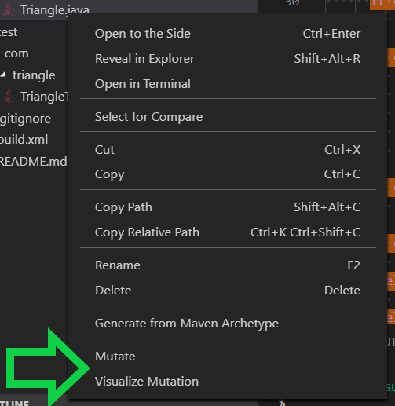
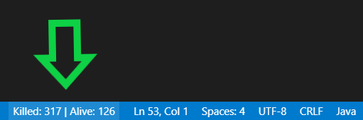

# Mutation Visualizer for Visual Studio Code

This extension visualizes the mutants and summary of mutation results for Java projects. It can also run a supported mutation framework, like PIT and Major. If you are looking to extend this project, see the

- User Facing Documentation (this file, README.md).
- [Developer Facing Documentation](DEVELOPMENT.md).
- [Evaluation Document](EVALUATION.md).
- Evidence of Testing and Debugging: See the Gitlab CI/CD pipelines and unit tests.
- Video Demo: https://drive.google.com/open?id=1lwWx-G0N8ysgpHw-XXGurMBMIKsV34Lo

## Getting Started

After downloading the .vsix installer from the repo, you can install it by running

```bat
code --install-extension mutation-viz-[version].vsix
```

After installing the extension, you can configure the color highlighting and the path to the output of your mutation framework in your user or workspace `settings.json`.

```json
{
    "mutation.outputFolder": "mutationReports",
    "mutation.outputFilename": "mutations.xml"
}
```

## Usage

### Mutate

You can trigger a supported mutation framework by:

1. Running the `Mutate` command from the VS Code Command Palette.

    

1. Right-clicking a code file in the project you want mutated and selecting `Mutate`.

    

If a file with highlighting is currently open, the highlight should update with the new result of the mutation test run upon completion. If this is the first time you've run the `Mutate` command, you may need to run `Visualize Mutation` in one of the methods described above.

### Code highlighting

When a Java file with an available mutation testing output is opened, the file will be read according to your workspace settings (or the extension defaults) and code highlighting will be displayed.


By default:

* lines with no killed mutants will be highlighted in red
* lines with some killed mutants and some alive mutants will be highlighted in orange
* lines with all mutants killed will be highlighted in green

These colors can be configured in your user or workspace settings.

```json
{
    "workbench.colorCustomizations": {
        "mutation.aliveBackground": "#1a00aa",
        "mutation.killedBackground": "#00ff3755"
      }
}
```

Now, with a blue highlight for alive mutants instead of red:


> Lines with both killed and alive mutants will display as a combination of the killed color and the alive color, and isn't customizable on its own.

### Mutant description on hover

If you want additional information about a specific code line, you can hover over it with your mouse to get a pop-up list of the mutations generated for that line and whether they were killed or not.


### Highlight toggling

You can toggle the visibility of the highlighting by clicking on the button in the status bar at the bottom of your VS Code window.



This button both displays the current file's killed and alive mutant count while functioning as a code highlighting toggle.

### Summary view of mutation results

When the extension is activated in a project with a supported mutation output, a summary view will open in a new tab. This Welcome Panel gives the user a holistic view of the mutation test analysis, including a table display of all mutants and column sorting.


Right-clicking a code file in the project and selecting `Visualize Mutation` will also trigger this page.


## Requirements

VS Code

## Extension Settings

If your mutation framework is set-up to use non-default paths for its testing output, be sure to configure the path and filename in your user or workspace `settings.json`. This extension's defaults are shown below.

```json
{
    "mutation.outputFolder": "mutationReports",
    "mutation.outputFilename": "mutations.xml"
}
```

If you're using ant, mutation-viz is configured to send the `ant mutate` command to your terminal, so be sure your build.xml contains a configuration with the same command.

## Release Notes

0.0.1 is the initial release of mutation-viz

### 0.0.1

Initial release of mutation-viz
